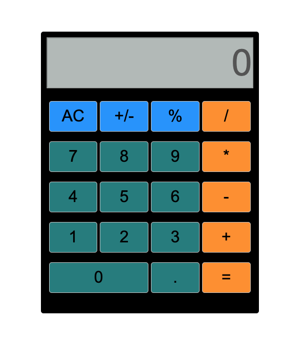

# Project: Calculator OverView

This is the Javascript foundations course in the Odin Project(URL:https://www.theodinproject.com/lessons/foundations-calculator).

(The Odin Project is the free course to become a fullstack web developer)

In this lesson, I had to create a Calculator using HTML / CSS /JavaScript.

# Web URL

<!-- Web Page: https://hiros-dev.github.io/Etch-A-Sketch/ -->

# Key Actions

# Screen Shot

<!--  -->

# What did I learn through this course

I had to combine everything I have learned so for to create Calculator.
So, I got a HTML / CSS / JavaScript knowledge more than before.

I think Calculator project is simple. 
But it is not easy.
(Especially, programmer want to create perfect calculator)

Because the project needs to use many JavaScript fundamentals(conditions, loops, DOM manipulation, etc. etc),
and needs to know many JavaScript knowledge(For example, if programmer does not know about Floating-Point Arithmetic, programmer met error through the project. If you want to know more check here: https://floating-point-gui.de/)

So, the project is very effective showcase to prove programmers skills.

Please check my written code and project demo.
I think my code proves my programming skill more than anything.

# Summary

I finished another project.
And this is the hardest project for me so far obviously.

I had to struggling few days to finish the project.
And my code is a little bit messy.
But, anyway, I could create the project by myself.
So, I am very proud me and my project.

Thank you for reading.
And, happy coding!!!